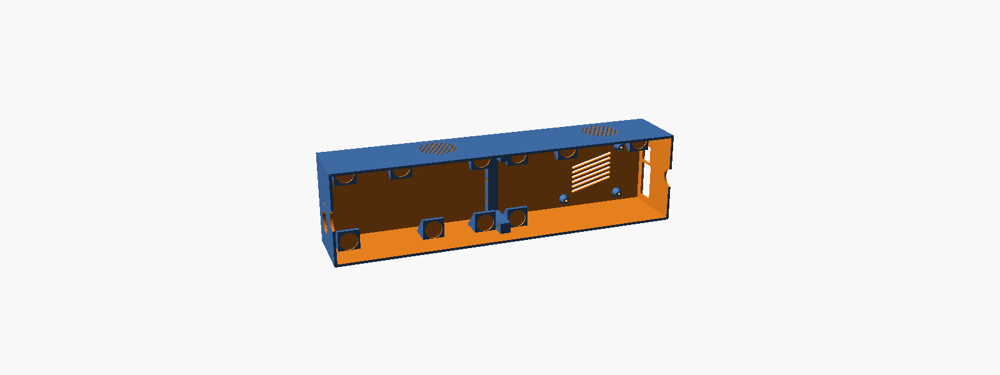
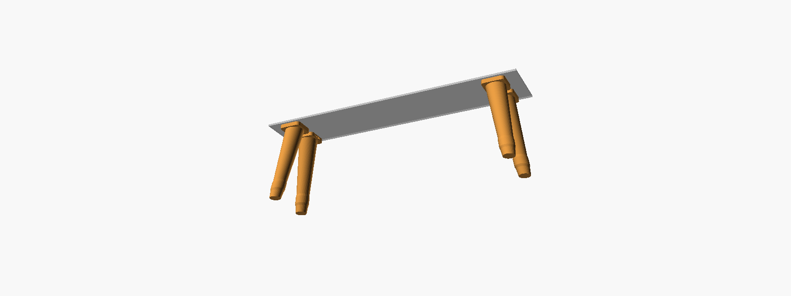

# scoreboard

An NHL scoreboard for a HUB75 LED matrix, delivered as a ready-to-flash
Raspberry Pi image.

Flash the image with the official [Raspberry Pi Imager](https://www.raspberrypi.com/software/)
("Use custom") and power it on — if it has no ethernet and no WiFi details
yet, it walks you through joining a network from your phone (see
[First-time WiFi setup](#first-time-wifi-setup) below). Set a favourite
team by editing a text file on the boot partition, and the board comes up
showing live scores.

On first boot the board grows its root filesystem to fill the rest of the SD
card and reboots itself once to finish — this is expected, not a fault; give
it a couple of minutes on the very first power-up.

## First-time WiFi setup

If the board has no ethernet connection and no `[wifi]` details in
`scoreboard.toml` yet, it broadcasts its own WiFi network
(`NHL-Scoreboard-Setup` by default) and shows the network name, password,
and a join QR code right on the panel — scan it, or join that network
manually from your phone's WiFi settings.

- Your phone should pop up a "Sign in to network" page on its own — pick
  your real WiFi network from the list (or type its name if it's not
  there) and its password, and submit.
- If that page doesn't appear automatically — common; captive-portal
  detection isn't fully reliable across every phone and OS — open a
  browser and go to `http://10.42.0.1` directly.

The panel shows "Connected!" once the board joins your network, or
restarts its own setup network so you can try again if something (usually
the password) didn't work.

**No phone handy, or would rather not use it?** You can skip all of this
by editing `[wifi]` in `scoreboard.toml` directly on the boot partition
before ever powering the board on — the same way every other setting here
works, and still fully supported, not replaced by the flow above.

## Hardware

| Part | Target |
|------|--------|
| Computer | Raspberry Pi 4 (Pi 3B+ also supported) |
| Display | 2 × 64×32 **P2.5** HUB75 panels, daisy-chained → **128×32** (320 × 80 mm) |
| Adapter | Seengreat-style RGB Matrix Adapter Board (also sold as XICOOLEE, WatangTech) |
| Power | One 5 V supply into the adapter's DC barrel jack; it feeds the panels and back-powers the Pi |
| Audio (optional) | USB speaker or USB audio adapter, for the goal horn — see [Audio](#audio) |
| Light sensor (optional) | BH1750 breakout on I2C (SDA/SCL/VCC/GND), for `auto_brightness` (#44) |
| Button (optional) | Momentary push-button between GPIO 26 and GND, for `[button]` (#50) |
| Case (optional) | 3D-printed enclosure, see [Enclosure](#enclosure) |

The adapter board's pinout is the driver's `regular` mapping, with output-enable
on GPIO 18. That is the hardware-PWM pin, so you get flicker-free refresh with
no modification — the Adafruit Bonnet needs a solder bridge for the same result.
An Adafruit board still works: set `hardware_mapping = "adafruit-hat"`.

**Power notes.** The board accepts USB-C (5 V / 4 A) or a 5.5 × 2.1 mm barrel
jack (5 V / 8 A) and passes 5 V to the Pi through the GPIO header. Two 64×32
panels can each draw ~2 A at full white, plus ~1 A for the Pi, so use the barrel
jack with a supply rated 6 A or better. At the default `brightness = 60` and
mostly-dark scoreboard content the real draw is far lower, but headroom is what
keeps the supply from browning out on a bright frame. **Do not also connect a
USB-C supply to the Pi** — two supplies feeding the same 5 V rail is a good way
to damage one of them.

Panel geometry is configuration-driven, so a single 64×32 or a 128×64 stack
works too — see `[panel]` in the config file.

## Enclosure

A 3D-printed case for the Pi and the two panels, designed in OpenSCAD
([`enclosure/`](enclosure/)). It prints in two halves that bolt together
(too wide for most beds), the panels hold on with their own magnetic screws,
and it has a side power-jack hole, a light sensor and speaker grilles in the bottom
wall, a port faceplate for the Pi, and vent slits.

[](enclosure/scoreboard-case-v3.png)

- Ready-to-slice STLs sit beside the models: `enclosure/scoreboard-case-v3-left.stl` and
  `-right.stl` (Pi 4), or the `-pi3b` pair for a Pi 3B+. Each case file prints the
  version it was built from on the inside of the back wall.
- Optional retro 70s legs to glue on afterwards: [`enclosure/legs/`](enclosure/legs/)
  (print four of `scoreboard-legs-leg.stl`).

[](enclosure/legs/scoreboard-legs.png)

Design notes, hardware list and the OpenSCAD commands are in
[`enclosure/README.md`](enclosure/README.md).

## Status

Early development. Working today:

- [x] NHL API client against `api-web.nhle.com` (live scores, period, clock)
- [x] 128×32 renderer with per-team accent colours
- [x] Hardware / emulator / headless display backends
- [x] rpi-image-gen image definition ([image/](image/))
- [x] CI pipelines — lint/test, plus an image build on native arm64 runners
- [x] Wi-Fi and settings applied from the boot partition on every boot
- [x] Team logos, rasterised at build time from the NHL's own artwork
- [x] Power play / empty net indicator for the favourite's game and the game on screen
- [x] Favourite mode: preview → countdown → live → final → next game's preview
- [x] Shots on goal, live, for every game; favourite's power play/empty net indicator
- [x] Favourite's conference standings, interleaved with the idle rotation
- [x] Opt-in season-series screen: the favourite's head-to-head record against their next opponent
- [x] Goal horn and GOAL celebration screen
- [x] Three stars of the game, once the favourite's game goes final
- [x] Auto-dim from an optional BH1750 ambient light sensor
- [x] Scheduled night mode that stays bright while a game is live
- [x] Root filesystem grows to fill the SD card on first boot
- [x] Optional web status page for headless debugging, with a config editor
- [x] `--demo` mode that loops every scene with synthetic data, no network needed
- [x] Optional push-button on GPIO 26: tap to mute the goal horn, hold to skip to the next game
- [x] Verified on real hardware

## Development

No LED panel required — the app falls back to
[RGBMatrixEmulator](https://github.com/ty-porter/RGBMatrixEmulator), which
renders to a browser window.

```bash
# One-shot setup: creates .venv, installs the dev extras, copies
# scoreboard.local.toml from the boot-partition template if it doesn't
# already exist, and fetches logos. Safe to re-run any time.
./scripts/setup-dev.sh
source .venv/bin/activate

# Print today's scores; needs no display at all
nhl-scoreboard --dump

# Run the board in the emulator, then open http://localhost:8888
# (edit scoreboard.local.toml first for favourite_team etc.)
nhl-scoreboard --backend RGBMatrixEmulator -c scoreboard.local.toml

# Loop every scene (live, goal, PP/EN, standings, ...) with made-up games,
# ~4s each, until Ctrl-C -- also works on the real panel with no network
nhl-scoreboard --demo --backend RGBMatrixEmulator -c scoreboard.local.toml

# Print frames as ASCII art - fastest way to iterate on layout
python scripts/preview.py --team NSH
python scripts/preview.py --fixture      # offline, uses the test fixture

# Rendering tests: every scene is snapshot-compared against tests/snapshots/
pytest -s tests/test_render.py           # -s prints each frame
pytest --update-snapshots                # after an intentional layout change
```

## Configuration

The running image reads `/boot/firmware/scoreboard.toml`. Because the boot
partition is FAT32, you can edit it from any computer after flashing the card.

```toml
[scoreboard]
favourite_team = "NSH"      # "" rotates every game in the league instead
prefer_favourite = true     # with no live/held favourite game, still show it first when rotating
countdown_hours = 2         # preview becomes a countdown this close to puck drop
final_hold_minutes = 30     # how long a final stays up before the next preview
timezone = "America/Chicago"
rotate_seconds = 8          # dwell per game with no favourite, and per idle scene below
poll_seconds = 60
live_poll_seconds = 15
show_logos = true           # false = three-letter abbreviations instead
logo_variant = "dark"       # the NHL's dark-background artwork; right for an LED panel
goal_flash_seconds = 6      # how long the GOAL screen stays up after your team scores
three_stars_seconds = 8     # how long the 3 STARS screen stays up once your team's game is final
show_clock_when_idle = true # clock when there's nothing left to preview; false = "NO GAMES"
show_standings = true       # favourite's conference playoff picture, once their season starts
show_clock_between_games = false  # also cycle the clock into the preview/standings alternation

# Optional: override the idle rotation's order and per-screen timing (see
# "What it shows" below). With no [[rotation]] tables, the list above
# (rotate_seconds/show_standings/show_clock_between_games) still applies.
# [[rotation]]
# screen = "countdown_preview"  # one of countdown_preview, standings, clock, matchup, top_west, top_east, leaders
# seconds = 10
# "matchup" (season series vs. the next opponent), "top_west"/"top_east" (top five of
# that conference) and "leaders" (your team's top goal scorer, top point getter and
# top two goalies) only show if listed here.

[audio]
enabled = true
device = ""                 # ALSA device, e.g. "plughw:1,0"; empty = aplay's default
horn_dir = ""                # override the search path for {ABBR}.wav horn files

[wifi]
ssid = ""                    # leave empty if you're using wired ethernet instead
password = ""
country = "CA"               # two-letter regulatory domain code, e.g. CA, US, GB
connect_timeout_seconds = 90 # how long a new SSID/password gets to connect before rolling back

[status]
enabled = true                # a web status page + config editor, for headless debugging; set false to turn off
port = 8080

[night_mode]
enabled = false              # dim overnight; never in the middle of a game
start_time = "22:30"         # 24-hour, local to timezone above; can wrap midnight
end_time = "07:00"
dim_brightness = 0           # 0-100; 0 blanks the panel outright instead of a dim screen
suppress_scope = "tracked"   # "tracked" = only the favourite's game holds off dimming; "all" = any live game
cooldown_minutes = 15        # how long after that game ends before dimming resumes

[holiday]
enabled = false              # seasonal decorations; each holiday only shows during its own dates
themes = ["halloween", "thanksgiving", "christmas"]  # also "thanksgiving_ca" (Canadian)
flyby_min_minutes = 5        # random gap between fly-bys (e.g. the Halloween ghost)
flyby_max_minutes = 20

[panel]
rows = 32
cols = 64
chain_length = 2            # two panels daisy-chained = 128x32
pitch_mm = 2.5              # informational; 128x32 at P2.5 is 320x80 mm
pixel_mapper = ""           # e.g. "U-mapper" to stack two panels into 64x64
hardware_mapping = "regular"  # "adafruit-hat" for an Adafruit Bonnet/HAT
rgb_sequence = "RGB"        # "RBG" if yellow looks pink / blue looks green (swapped wiring)
gpio_slowdown = 4           # 4 suits a Pi 4; try 2 on a Pi 3
brightness = 60
auto_brightness = false     # dim from a BH1750 ambient light sensor on I2C instead (#44)
min_brightness = 10         # clamp range for auto_brightness
max_brightness = 100
brightness_poll_seconds = 5
```

## SSH access

The board is headless — no monitor, no keyboard — so SSH is the way in for
anything the boot-partition TOML or the [status page](#status-page) can't
cover.

| | |
|---|---|
| Username | `scoreboard` |
| Password | `Scoreboard1!` |
| Host | the board's IP on your network (check your router's DHCP client list — there's no `.local`/mDNS name set up) |

**Change the password** (`passwd`) before putting the board on any network
you don't fully trust — this default is baked into every flashed image and
is public in this repository's source (`image/config/scoreboard.yaml`), the
same way a router's printed default password is. The account can `sudo`
(password-protected, not passwordless) for anything that needs it.

## What it shows

With a `favourite_team` set (the default, `NSH`), the board follows your team's day:

| When | Board shows |
|---|---|
| Morning of a game (or no game today) | **Preview** — logos, `TONIGHT` / `TOMORROW` / `SAT OCT 4`, start time |
| Inside `countdown_hours` of puck drop | **Countdown** — start time and `IN 1H 29M`, ticking to `IN 00:59` |
| Game in progress | **Live** — scores, period and clock, power-play indicator |
| Your team scores | **GOAL** — a celebration screen, for `goal_flash_seconds`, then back to live |
| Game just went final | **3 STARS** — the NHL's three stars and their stat for the game, for `three_stars_seconds`, once they're named |
| Final, for `final_hold_minutes` | **Final** — the result stays up |
| After that | Preview of the next game on the schedule |

The next game comes from the team's season schedule, fetched once an hour.
While there's no favourite game to show live, the board cycles an **idle
rotation** of up to three screens: the preview/countdown above, your
**conference standings** (`show_standings`, once your team's season has
actually started), and, if `show_clock_between_games` is on, the **idle
clock**. By default each stays up for `rotate_seconds`; add `[[rotation]]`
entries to `scoreboard.toml` to reorder them, drop one, or give each its
own duration instead (see [Configuration](#configuration)) -- a screen with
nothing to show right now is skipped, not shown blank. With no
`favourite_team` set (or nothing left for it to show), the board instead
rotates through every game in the league today, `rotate_seconds` each,
favourite first (`prefer_favourite`). The GOAL screen and the horn both
still only ever fire for your favourite team's own goal.

Overnight, `[night_mode]` can dim the panel on a schedule — but never while
a tracked game is live or was held recently, so a late finish stays
readable.

`[holiday]` adds seasonal decorations on top. In October, a ghost floats
across the board every so often (even during games, though never over a
GOAL screen) and jack-o'-lanterns flank the clock. The week of Thanksgiving
(US, or Canadian if you tick it), a turkey walks along the bottom instead,
with autumn leaves beside the clock. Through December 26, Santa walks
across dropping presents, and snow falls on a pile of presents beside the
clock.

## Audio

The board can play a horn through a USB speaker or USB audio adapter when
your favourite team scores. This is the only sound the board can make — see
[Hardware](#hardware) for why the 3.5 mm jack and I2S DACs are unavailable.

A default siren is included (synthesized, not sampled — there's no way to
ship a real broadcast horn without infringing on someone's copyright) so
audio works with zero configuration once a speaker is plugged in. Drop a
recording named `{ABBR}.wav` (e.g. `NSH.wav`) into the horn directory to use
your team's actual horn instead; it's checked first, and the default plays
whenever a team-specific file isn't found. See `[audio]` in
[Configuration](#configuration).

## Status page

The board is headless by design, so diagnosing "why is it stuck" would
otherwise mean SSH-ing in and reading `journalctl -u nhl-scoreboard`. On by
default, the board instead serves a small HTML page at
`http://<board's-ip>:8080/` showing the current scene, the last successful
API poll, the last error (if any) and the favourite team -- enough to check
on the board from a phone on the same network. It's
stdlib `http.server`, no framework, and has no login: it binds the local
network the board is already trusted on, not the internet, so don't
port-forward it. Set `[status] enabled = false` in the config to turn it
off.

Below that is a form per config section (scoreboard, audio, status,
night mode, panel, Wi-Fi) that edits `scoreboard.toml` directly -- no
SSH or SD card needed. Saving writes the file with `tomlkit` (comments in
the file survive) and the running board picks the change up within a
second, the same way it already does for a hand-edited file over SSH.
`[panel]` fields that need a process restart to take effect (geometry,
GPIO mapping, ...) are still editable here, just labelled as such. Saving
Wi-Fi settings restarts the board's network connection live -- briefly
interrupting it -- and rolls back automatically if the new network
doesn't come up, the same rollback `scoreboard-provision` already does at
boot. A submitted form is checked against the request's own `Host`
header to reject cross-site submissions, but there's still no login: as
with the rest of the page, this assumes the LAN itself is trusted.

## Layout

With logos (the default):

```
┌──────────────────────────────────────┐
│ ▄▄▄▄▄▄                        ▄▄▄▄▄▄ │
│ █ TOR █      3    │    2      █ MTL █ │
│ █logo █     ─────────────     █logo █ │
│ ▀▀▀▀▀▀        2ND 12:34       ▀▀▀▀▀▀ │
└──────────────────────────────────────┘
```

The line under the scores shows shots on goal, `SOG 12-9`, for every game.
During a power play or with a goalie pulled it's replaced by an amber
indicator on the side of the team it applies to instead — `PP 1:23`,
`5v3 0:41`, `EN`. That state comes from a second, per-game API call, which is
made only for your favourite team's game and whichever game is on screen, so
other games in the rotation show shots on goal even when a penalty is
actually in effect.

Text fallback, used when `show_logos = false` or a team's artwork is missing:

```
┌──────────────────────────────────────┐
│  TOR      3   │   MTL             2  │
│──────────────────────────────────────│
│              2ND 12:34               │
└──────────────────────────────────────┘
```

Logos come from `assets.nhle.com`, the same source the NHL's score API links
per team. `scripts/fetch-logos.py` downloads the SVGs and rasterises them to
32×32 PNGs; CI runs it before every image build. The PNGs are git-ignored, so
this repository never redistributes the artwork.

## Licence

MIT — see [LICENSE](LICENSE). Bundled BDF fonts come from
[rpi-rgb-led-matrix](https://github.com/hzeller/rpi-rgb-led-matrix) and derive
from the public-domain X11 "misc-fixed" fonts; see [fonts/README.md](fonts/README.md).

Not affiliated with or endorsed by the National Hockey League.
